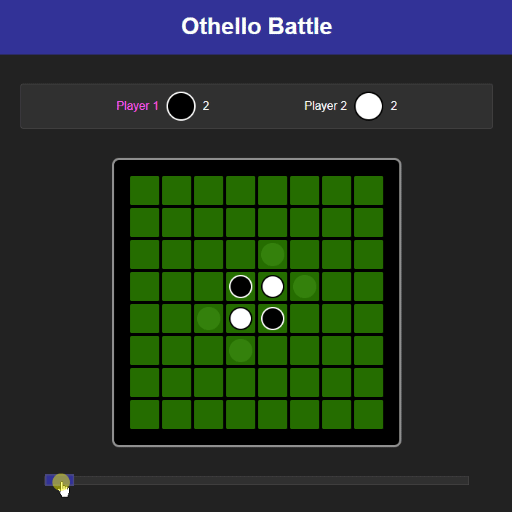

# Othello Battle

This project contains the base for a fun late night competition amongst friends where each contestant implements an 
Othello bot. The bots will then face eachother in a tournament eliminating each other until one is left victorious.  

<p align="center">
  
</p>

## Rules 

* Only implement the abstract methods of Player.
* Don't access private members.
* Honour contracts, follow the documentation.
* An error occuring results in the player causing the error to lose the game.
* Making a move is limited to 5 seconds. Taking longer results in a loss.

## Instructions

### Make a fork

Click the fork button in the github interface

### Clone your fork

Clone your fork using [git](https://git-scm.com/downloads)

```sh
$ git clone <url-to-your-fork>
$ cd <your-fork>
```

### Install

Install the dependencies using [npm](https://nodejs.org/en/download/)

```sh
$ npm install
```

### Implement a player

Example:

```js
// #/src/bot/RandomBot.js
import { Player } from "../game/Player";

export class RandomBot extends Player {
    constructor(name, color) {
        super(name, color);
    }

    async getNextMove(state) {
        const possibleMoves = state.getPossibleMoves();
        const randomMove = possibleMoves[ Math.floor(Math.random() * possibleMoves.length) ];

        return { x: randomMove.x, y: randomMove.y };
    }

    clone() {
        return new RandomBot(this.name, this.color);
    }
}
```

### Try it out

Add your implementation to the player list

```js
// #/src/app.js
const players = [
    new RandomBot("A", "black"),
    new RandomBot("B", "white")
];
```

Serve the application locally

```sh
$ npm start
```         

Visit `localhost:8080` in a browser and see them go!

### Push it

```sh
$ git add src/bot/RandomBot.js
$ git commit -m "Add random bot player implementation"
$ git push
```

### Create a pull request 

A pull request can be made in your forked project UI on github
